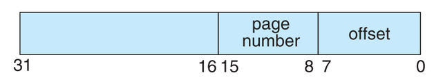
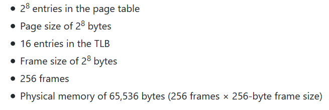
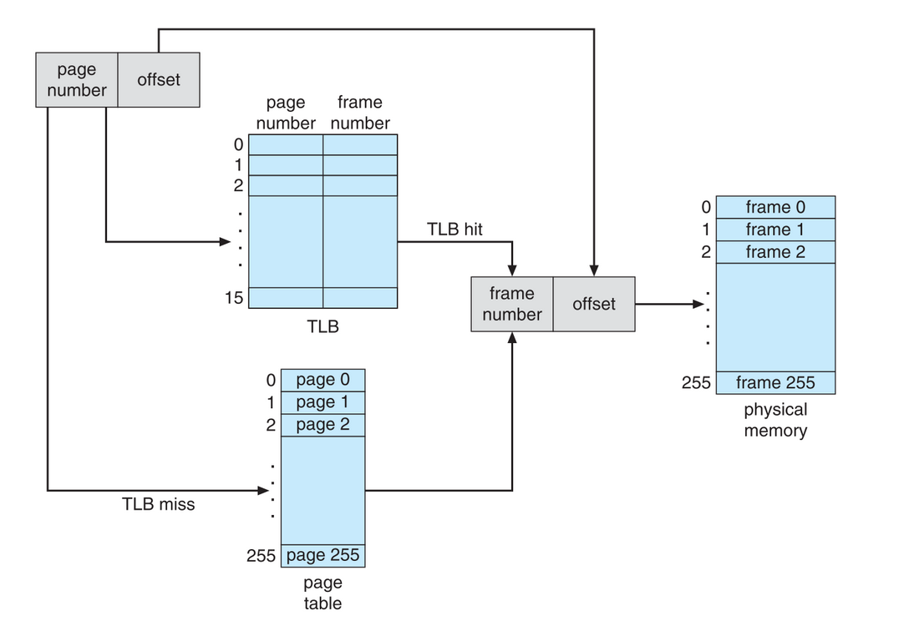

# Virtual-Memory-Unit
The program reads from a file containing logical addresses and converts these logical address to its corresponding physical address using a TLB and Page Table. Also, the program will output the value of the byte stored at the translated physical address. The program outputs a CSV file that has three columns:

1. The logical Address being translated read from address.txt
2. The corresponding physical address (what the program translates the logical address to)
3. The signed Byte Value stored in physical stored in physical memory at the translated physical address

# Details 
The program reads from a file containing 1000 32-bit numbers that represent logical addresses. The first 16 bits contain (1) an 8-bit page number and (2) an 8-bit page offset. The address is structured as shown:

Additional details:

# Address Translation
The program will translate logical to physical addresses using a TLB and page table. First, the page number is extracted from the logical address, and the TLB is consulted. In the case of a TLB hit, the frame number is obtained from the TLB. In the case of a TLB miss, the page table must be consulted. In the latter case, either the frame number is obtained from the page table, or a page fault occurs. A visual representation of the address-translation process is:

# Page Replacement (Part 2)

Thus far, this project has assumed that physical memory is the same size as the virtual address space. In practice however, physical memory is typically much smaller than a virtual address space. This phase of the project now assumes using a smaller physical address space with 128 page frames rather than 256. This change will require modifying the program so that it keeps track of free page frames as well as implementing a page-replacement policy using LRU to resolve page faults when there is no free memory.

# Statistics
After completion, the program reports the following statistics in standard output:

1. Page-fault rate: the percentage of address references that resulted in page faults.
2. TLB hit rate: the percentage of address references that were resolved in the TLB.

